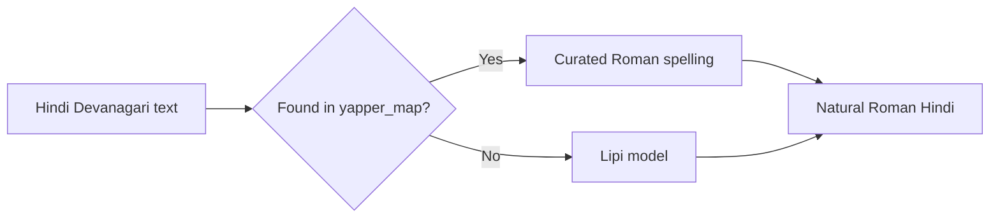
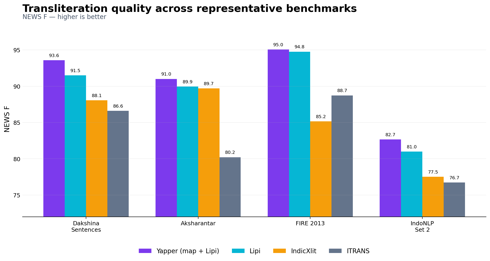
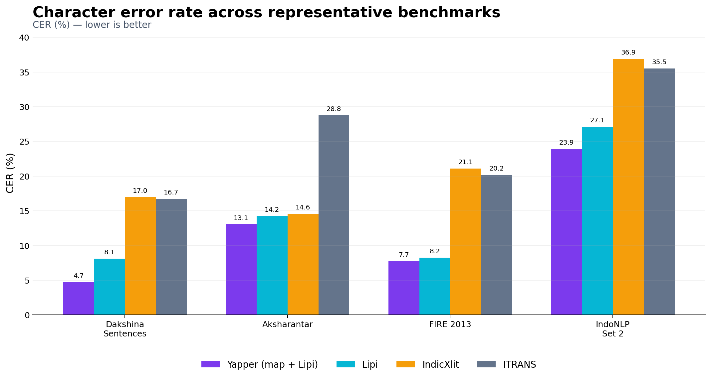

# Yapper Transliterator

<p align="center">
  <strong>SOTA Natural Hindi Devanagari → Roman transliteration</strong><br>
  A map-first system with <strong>Lipi</strong>, a compact neural fallback.
</p>

<p align="center">
  <a href="LICENSE"></a>
  
  
  
  
</p>


Yapper Transliterator romanizes Hindi written in Devanagari using spellings common in messages, search, dictation, and Hinglish interfaces. Frequent words are resolved by a curated dictionary; unseen words fall back to Lipi.

```bash
python transliterate.py --text "मैंने कहा कि भारत महान है"
# maine kaha ki bharat mahan hai
```

## Why Yapper Transliterator

- **Natural output:** prioritizes commonly typed Roman Hindi rather than formal ISO/ITRANS conventions.
- **Map-first accuracy:** `yapper_map` contains **1,172,875** curated entries.
- **Compact fallback:** Lipi has **544,653 parameters** and is designed for CPU and edge inference.
- **Fast decoding:** non-autoregressive CTC with greedy decoding and optional prefix beam search.
- **Mixed-text safe:** Latin text, punctuation, and whitespace pass through unchanged.



## Installation

```bash
git clone https://github.com/ABHISHEKgauti25/yapper_transliterator.git
cd yapper_transliterator
pip install torch
```

## Quick start

### Command line

```bash
# Recommended: map + Lipi fallback
python transliterate.py --text "नमस्ते दुनिया"

# Lipi model only
python transliterate.py --text "एक्सप्रेस" --backend lipi

# File input, line in / line out
python transliterate.py --input-file in.txt > out.txt

# Per-word source: map or Lipi
printf "मैंने कहा\n" | python transliterate.py --json

# Optional prefix-beam decoding
python transliterate.py --text "क्षमा" --backend lipi --beam-width 8
```

### Python

```python
from yapper_transliterator import Transliterator

transliterator = Transliterator()  # backend="map_lipi"

transliterator.transliterate_word("नमस्ते")
# "namaste"

transliterator.transliterate_text("मैंने कहा")
# "maine kaha"

transliterator.transliterate_words(["भारत", "क्षमा"])
```

A populated checkout discovers `models/lipi/` and `data/yapper_map.json` automatically. Explicit paths are also supported:

```python
Transliterator(
    backend="map_lipi",
    model_dir="/path/to/lipi",
    map_path="/path/to/yapper_map.json",
)
```

## Backends

| Backend | Operation | Use case |
|---|---|---|
| `map_lipi` *(default)* | `yapper_map` first, Lipi on a miss | Best overall quality and coverage |
| `lipi` | Lipi only | Model-only evaluation or map-free deployment |

## Lipi architecture

Lipi processes Devanagari orthographic clusters (**aksharas**) rather than flattening the input into independent characters. Each cluster is composed from its Unicode codepoints and passed through:

1. codepoint and position embeddings,
2. learned output-slot expansion,
3. a two-layer bidirectional GRU,
4. a CTC character head.

This keeps the model small while allowing it to generalize to rare words and unseen conjuncts. See [`docs/ARCHITECTURE.md`](docs/ARCHITECTURE.md) for the complete design.

## Benchmark highlights

### NEWS F — higher is better

<p align="center">
  
</p>

### Character error rate — lower is better

<p align="center">
  
</p>

Representative results for the recommended `map_lipi` backend:

| Benchmark | Evaluation | Result |
|---|---|---:|
| Dakshina test | 5,000 sentences | **4.70% CER**, 93.58 NEWS F |
| Dakshina words test | 2,500 multi-reference words | **98.32% in-attested**, 99.81 NEWS F |
| Aksharantar test | 10,112 words | **46.29% exact**, 91.00 NEWS F |
| FIRE 2013 dev | 2,420 typed Hindi tokens | **76.61% exact**, 95.05 NEWS F |
| IndoNLP 2025 Set 2 | 4,991 reversed-evaluation sentences | **23.92% CER**, 82.66 NEWS F |

Full reports:

- [`benchmarks/report_test.md`](benchmarks/report_test.md)
- [`benchmarks/report_dev.md`](benchmarks/report_dev.md)

Benchmark datasets use different annotation styles and reference conventions. Consult the full reports before comparing or citing individual scores.

## Project structure

```text
yapper_transliterator/
├── README.md
├── LICENSE
├── transliterate.py
├── yapper_transliterator/
│   ├── lipi.py
│   ├── tokenizer.py
│   ├── data.py
│   ├── decoding.py
│   ├── runtime.py
│   ├── io_utils.py
│   └── transliterator.py
├── models/
│    ├── lipi/
│    └── MODEL_CARD.md
├── data/yapper_map.json
├── assets/
├── benchmarks/
├── docs/ARCHITECTURE.md
├── examples/quickstart.py
└── tests/
```

## Scope and limitations

Yapper Transliterator currently targets **Hindi Devanagari → Roman Hindi**. It is not a Roman-to-Devanagari model, a multilingual transliterator, or a formal academic romanization system. Proper names, borrowings, schwa deletion, dialectal spellings, and multiple equally valid Roman forms remain challenging. Single-reference exact-match metrics can therefore undercount acceptable output.

## Model release

The Hugging Face model release is named **Lipi** and is published as part of **Yapper Transliterator**. The standalone model card is available in [`models/MODEL_CARD.md`](models/MODEL_CARD.md); the copy intended for the Hugging Face model repository is in [`huggingface/README.md`](https://huggingface.co/abhishekgautamm/lipi-hindi-roman-transliteration).

## Licensing

The repository code is licensed under Apache-2.0. The model weights, `yapper_map`, and derived data artifacts may carry additional obligations from their source corpora. Review the applicable upstream terms before redistribution or commercial deployment.

| Source | Use in Yapper Transliterator |
|---|---|
| Dakshina | Map, model-data preparation, evaluation |
| Xlit-Crowd | Map and model-data preparation |
| L3Cube | Map and model-data preparation |
| Aksharantar | Map/model-data preparation and evaluation |
| FIRE 2013 | Evaluation |
| IndoNLP 2025 | Evaluation |

## Citation

```bibtex
@software{yapper_transliterator_2026,
  title   = {Yapper Transliterator},
  author  = {Abhishek Gautam},
  year    = {2026},
  version = {0.1.0},
  url     = {https://github.com/ABHISHEKgauti25/yapper_transliterator}
}
```

Please also cite the original datasets when reporting benchmark results.
