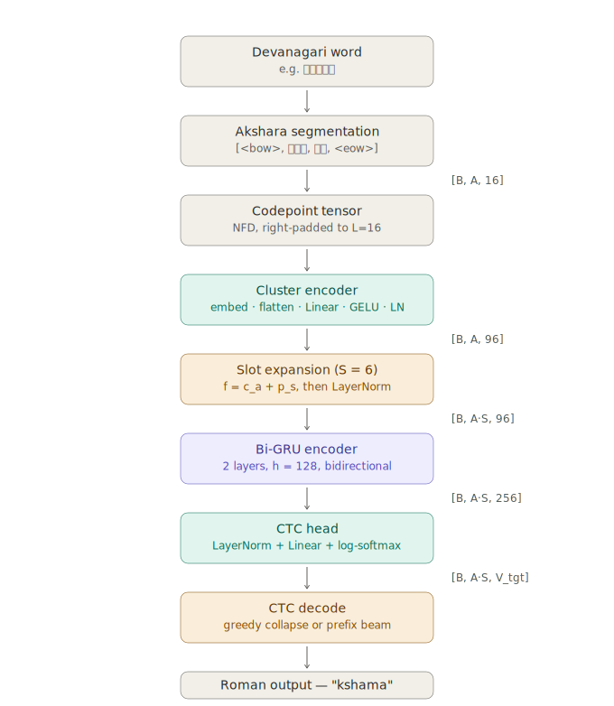

# Lipi: A Compact Non-Autoregressive Model for Devanagari→Roman Transliteration

> **Naming.** This design was prototyped internally as *AksharaCTC*; it ships as **Lipi**, the model referenced throughout this package. The two names refer to the same architecture.

<p align="center">
  
  <br>
  <em>Figure 1. End-to-end forward pipeline. Neutral blocks are input/output processing; teal blocks are linear transformations; amber blocks are the two CTC-specific innovations (slot expansion and CTC decoding); the purple block is the recurrent encoder. Tensor shapes annotate the transitions.</em>
</p>

---

## Abstract

Lipi is a small (~0.5 M parameter), non-autoregressive neural transliterator that serves as the out-of-vocabulary (OOV) fallback for the Yapper Devanagari→Roman transliteration system. Where the deterministic map already resolves the common case (1.17 M curated word forms), the model specialises in generalising the character-level regularities of Devanagari to unseen words — proper nouns, novel inflections, code-mixed tokens, typos. Three design choices distinguish it from a shrunken IndicXlit: (i) an akshara-level source representation that keeps orthographic clusters intact, (ii) a codepoint-composed embedding within each cluster, so unseen conjuncts still receive a compositional representation, and (iii) a *learned slot expansion* that gives the CTC decoder a fixed multiplicative emission budget per akshara, replacing the ad-hoc upsampling used by most non-autoregressive character models. On CPU inference the model runs in a single forward pass with greedy CTC collapse, or with a prefix-beam decoder when higher-quality N-best output is required.

---

## 1. Motivation

The Yapper pipeline is map-first. A curated dictionary handles 1.17 M Devanagari word forms drawn from Dakshina, Xlit-Crowd, L3Cube usage data, and a curated review pass over Aksharantar. On every conflict, the curated pick wins. At inference time the neural model is only invoked for a token that misses the map. This changes the design objective compared to a general-purpose transliterator such as IndicXlit:

- Frequent words never reach the model; there is no need to co-optimise for them.
- The residual distribution is dominated by named entities, low-frequency inflections, English loans in Devanagari, and typographic variants — cases where memorisation cannot help and generalisation must.
- The latency budget is tight: OOV tokens can appear anywhere in a stream, so the model has to run cheaply on CPU without a per-token beam search.

Two properties of Devanagari→Roman make an aggressively small model feasible.

1. **Devanagari is largely phonemic**, so the mapping from graphemes to Roman characters is close to deterministic *within an akshara*.
2. **The alignment is monotonic** — Roman characters are emitted in source order, with no reordering.

These properties invite a non-autoregressive, encoder-only architecture with a Connectionist Temporal Classification (CTC) objective, which trains a single softmax per output frame and marginalises over all monotonic alignments.

The one hard sub-problem is schwa deletion. Hindi grapheme-to-phoneme conversion is otherwise trivial; whether the inherent vowel of a consonant is pronounced (*नमक* → *namak*) or deleted (*नमकीन* → *namkeen* rather than *namakeena*) depends on prosodic context, and any purely local rule mispredicts a meaningful fraction of cases. Prior work has shown that a statistical classifier operating on the orthography alone reaches state-of-the-art accuracy on this sub-task; a small bidirectional recurrent encoder over aksharas is more than sufficient to capture the left/right context it needs.

---

## 2. Task Formulation

Let `x = x_1 x_2 … x_N` be a Devanagari source string and `y = y_1 y_2 … y_M` its Roman transliteration. The model learns a distribution `p(y | x)` under a monotonic alignment assumption. We decompose the source into akshara clusters `a_1, …, a_A` (§3), and expand each cluster into `S` frames (§4.3), yielding a fixed emission budget of `T = A · S` frames. A CTC head produces a distribution over `V_tgt` target characters (including a blank symbol) at each frame:

```
p(y | x) = Σ_{π ∈ B⁻¹(y)}  Π_{t=1..T}  p(π_t | x)
```

where `π` ranges over CTC alignments of length `T` and `B` is the collapse operator that removes consecutive repeats and blanks.

---

## 3. Tokenization

### 3.1 Source normalisation

Devanagari admits multiple encodings for canonically equivalent forms — most notably, nukta-decorated consonants may be written as a single codepoint or as base + combining nukta (U+093C). Zero-width joiners (ZWJ, U+200D) and non-joiners (ZWNJ, U+200C) affect glyph shaping but not phonology. The source pipeline applies, in order:

1. Unicode NFD normalisation, canonicalising all nukta and matra spellings to a decomposed form.
2. Removal of ZWJ and ZWNJ.
3. Whitespace stripping.

This makes the codepoint alphabet compact (well under 100 distinct symbols) and eliminates a class of hidden accuracy losses in which semantically identical inputs are treated as different sequences.

### 3.2 Akshara segmentation

An *akshara* is the orthographic syllable of a Brahmic script: a base consonant optionally decorated by combining marks (vowel signs, anusvara, chandrabindu, nukta), and optionally joined by virama (halant, U+094D) to a following consonant to form a conjunct. Naive Unicode-codepoint splitting shreds these clusters and forces the model to relearn the assembly rules from data. The segmenter (`segment_aksharas` in `tokenizer.py`) walks the string once:

1. A cluster begins at a base character.
2. Combining marks — Unicode category starting with `M` — are absorbed into the current cluster.
3. A virama absorbs the *following* base character (and any intervening joiner), so conjuncts such as *क्ष* (क + virama + ष) are emitted as a single cluster.
4. Non-Devanagari symbols form singleton clusters.
5. Clusters exceeding a hard bound of 16 codepoints are chopped — a case that never arises on real Hindi text.

The word *क्षमा* therefore segments as `[क्ष, मा]`. The sequence is bracketed with `<bow>` and `<eow>` markers, giving the encoder unambiguous access to word boundaries — a small but consistent win for boundary-sensitive cases.

### 3.3 Codepoint encoding within an akshara

A conventional choice would be to build a vocabulary of aksharas and use a single embedding per cluster. Two problems: the akshara vocabulary is unbounded (any new conjunct in an OOV word is unseen), and the embedding does not compose over its parts. Instead each cluster is represented as an *ordered* sequence of its constituent codepoints, right-padded to length `L = 16`:

```
a_i ∈ ℤ^L,   L = 16
```

An embedding lookup and a shared projection compose these codepoints into a single dense vector per cluster (§4.2). Unseen conjuncts therefore receive a meaningful representation whenever their constituent codepoints have been seen — which, given the codepoint alphabet size, is almost always.

### 3.4 Target vocabulary

The target is a case-folded Roman string, encoded character-by-character. The vocabulary consists of Roman letters plus any word-boundary punctuation retained by the corpus. `<blank>` is reserved at index 0, which the CTC loss and decoder assume.

---

## 4. Architecture

Given a batch of `B` words, the input tensor has shape `[B, A_max, L]` where `A_max` is the padded akshara count and `L = 16` is the fixed cluster codepoint budget. A per-sample `source_lengths` tensor tracks the true akshara count.

### 4.1 Reference configuration

| Hyperparameter | Symbol | Value |
|---|---|---|
| Max codepoints per cluster | `L` | 16 |
| Slots per akshara | `S` | 6 |
| Codepoint embedding dim | `d_c` | 32 |
| Cluster / model dim | `d` | 96 |
| GRU hidden size (per direction) | `h` | 128 |
| GRU layers | | 2 |
| Dropout | | 0.10 |

### 4.2 Codepoint embedding and cluster projection

Each codepoint id `x_{i,ℓ}` is looked up in an embedding table `E ∈ ℝ^{V_src × d_c}`. The `L` codepoint embeddings of a cluster are concatenated in order:

```
e_i = [ E[x_{i,1}] ‖ E[x_{i,2}] ‖ … ‖ E[x_{i,L}] ] ∈ ℝ^{L·d_c}
```

A cluster-projection block maps this to the model dimension:

```
c_i = LN( Dropout( GELU( W_c · e_i + b_c ) ) ) ∈ ℝ^d
```

Two features of this design deserve emphasis. First, position within a cluster is *implicit* in the concatenation order: the projection matrix learns codepoint-position-specific weights (the first 32 columns of `W_c` attend the base character, the next 32 the first combining mark, and so on). This is cheap — a single `L·d_c × d` matrix — and it lets the model treat, for example, "base + nukta" differently from "base + matra" without an explicit position embedding. Second, padding codepoints are zeroed via the embedding's `padding_idx`; short clusters therefore project through a mostly-zero flatten and rely on the projection bias.

### 4.3 Learned slot expansion

CTC requires the emission budget to meet or exceed a lower bound determined by the target. For a target string `y` of length `M` with `R` pairs of adjacent identical characters, the minimum number of frames is

```
T_min(y) = M + R
```

because CTC must insert a blank between any two identical labels. A source of `A` aksharas gives `A` encoder positions if we do nothing — often insufficient. Example: *एक्सप्रेस* → *express* has 4 aksharas but 7 output characters, and the double *s* forces a blank between them.

The standard fix in non-autoregressive character models is *upsampling*: broadcast each source vector into a fixed number of copies. Copies with no positional variation confuse the recurrent encoder — every frame from cluster `i` looks identical. We use a **learned slot expansion** instead. Let `P ∈ ℝ^{S × d}` be a table of `S` learned "slot" vectors. Each cluster expands to `S` frames:

```
f_{i,s} = c_i + P_s,     s = 1, …, S
```

The frames are concatenated across aksharas into a sequence of length `T = A · S` and passed through a final `LayerNorm` (`frame_norm`). Two consequences:

1. Frames from the same cluster now differ, giving the encoder a positional signal it can use to distribute emissions across the slot budget (e.g., emit *k* at slot 0, *s* at slot 2, *h* at slot 4 for *क्ष* → *ksh*).
2. The slot vectors are shared across aksharas, so their meaning is *positional within a cluster*, not absolute in the sentence. This is the correct inductive bias: slot 3 always means "third emission opportunity of this akshara", regardless of where the akshara sits.

The default `S = 6` was chosen so that `A · S` comfortably exceeds `T_min` for every training target. The helper `required_slots(source, target)` in `tokenizer.py` computes the exact minimum for a given pair, which is used at data preparation time to filter out pathological over-length targets.

### 4.4 Bidirectional GRU encoder

The frame sequence is fed to a two-layer bidirectional GRU with hidden size 128 per direction. Inputs are packed with `pack_padded_sequence` so padded frames contribute no computation, and unpacked back to a fixed length equal to `A_max · S`. The output is a per-frame vector of dimension `2h = 256`.

Two motivations for GRU over Transformer at this scale:

- The sequence is monotonic, short (typically `T = A · S < 60`), and does not benefit from global content-based routing. A recurrent encoder captures the local left/right context that schwa deletion and akshara-junction decisions actually depend on.
- A BiGRU has fewer parameters and lower CPU inference cost than a comparable Transformer, and does not require positional encodings on top of the slot expansion.

### 4.5 CTC output head

The per-frame encoder output is normalised, dropout-regularised, and projected to the target vocabulary:

```
z_t = W_o · Dropout( LN( h_t ) ) + b_o     ∈ ℝ^{V_tgt}
```

`z_t` is passed through log-softmax and consumed by the CTC loss during training, or by the decoder at inference.

---

## 5. Training Objective

Given a batch of frame logits `Z ∈ ℝ^{B × T × V_tgt}` with per-sample frame lengths `T_b = A_b · S` and target lengths `M_b`, the loss is the standard CTC negative log-likelihood

```
L_CTC = − Σ_{b=1..B}  log p( y^(b) | x^(b) )
```

where the inner probability marginalises over all monotonic alignments as in §2. CTC handles the length mismatch between `T_b` and `M_b` automatically, provided `T_b ≥ T_min(y^(b))`.

---

## 6. Inference

### 6.1 Greedy decoding

The default decoder is CTC greedy: at each frame, take the argmax over `V_tgt`, then apply the collapse operator that removes consecutive repeats and blanks (`collapse_ctc` in `decoding.py`). This is a single forward pass and a linear-time collapse — the fast path.

### 6.2 Prefix beam search

When N-best output or fuller marginalisation is required, `ctc_prefix_beam_search` implements a standard log-space prefix beam decoder. Each prefix maintains two probabilities:

- `α_blank`: total probability of alignments ending in blank.
- `α_nonblank`: total probability of alignments ending in the last non-blank label.

At each frame the top-`K` tokens (by log-prob) are considered for extension, with the blank symbol forcibly included. Extensions update the two-probability state so that:

1. Blank emissions accumulate into the "ending-in-blank" mass without extending the prefix.
2. Repeating the last non-blank symbol either extends the prefix (via a preceding blank) or accumulates on the existing prefix (no blank between).
3. Any other non-blank symbol extends the prefix and merges both blank/nonblank predecessors.

The final ranking sums the two masses per prefix. Token pruning (default 16 per frame) keeps the inner loop small; beam width 8 is typically sufficient for OOV transliteration.

---

## 7. Design Rationale

### 7.1 Akshara-level rather than codepoint or subword

A pure-codepoint model must relearn cluster assembly from data and produces sequences roughly twice as long, doubling encoder cost. A subword (BPE) model is superfluous at Devanagari's alphabet size and hurts OOV generalisation because unseen conjuncts fall on token boundaries that the merge table has never seen. Akshara-level segmentation aligns naturally with the syllable-level regularities of the script and keeps the target alignment nearly one-akshara-to-one-syllable — precisely the monotonic structure CTC handles best.

### 7.2 Composing the akshara embedding from codepoints

Two reasons already noted: unbounded akshara inventory, and compositional generalisation. A third is memory. A codepoint vocabulary of ~100 symbols with 32-dim embeddings is ~3 K parameters; an akshara vocabulary large enough to cover training data plausibly runs to tens of thousands, wasting most of the parameter budget on rare clusters.

### 7.3 Learned slot expansion rather than fixed upsampling

Fixed upsampling gives every frame from cluster `i` an identical representation, so the BiGRU must produce different outputs from identical inputs — the only signal is the surrounding context. In practice this leads to under-emission at the ends of long conjuncts. Learned slot embeddings give each frame its own positional identity within the cluster; the encoder can then use slot 0 for the base consonant, slot 2 or 3 for a matra, and so on. Because the slots are shared across aksharas, the total parameter cost is `S · d = 576` — negligible.

### 7.4 BiGRU rather than a small Transformer

For sequences under 60 frames with monotonic structure, a Transformer's self-attention is spending capacity on a problem that isn't there. A two-layer BiGRU is smaller, faster on CPU, has no positional-encoding scheme to design, and gives the schwa decision the local bidirectional context it needs. If the sequence length were to grow substantially, or if long-range agreement mattered, this trade-off would flip; it does not, for the target domain.

### 7.5 CTC rather than autoregressive decoding

Devanagari→Roman is monotonic. CTC's monotonic-alignment assumption — which weakens it for general machine translation, where global reordering matters — is a *feature* here rather than a limitation. In exchange, we get single-forward-pass inference, no beam search on the fast path, and a training-time marginalisation that removes the need for silver alignments.

### 7.6 Explicit `<bow>` and `<eow>` markers

Word boundaries carry information: schwa deletion in Hindi is sensitive to word-final position, and the leading akshara often behaves differently from an internal one. Explicit boundary markers give the encoder an unambiguous signal without requiring an extra padding/mask channel.

---

## 8. Parameter Budget

Approximate parameter counts for the reference configuration, assuming `V_src ≈ 150` and `V_tgt ≈ 32`:

| Component | Parameters |
|---|---:|
| Codepoint embedding `E` | 4,800 |
| Cluster projection Linear (512 → 96) | 49,248 |
| Cluster projection LayerNorm | 192 |
| Slot embedding `P` | 576 |
| Frame LayerNorm | 192 |
| BiGRU layer 1 (input 96, `h`=128, bidir) | 173,568 |
| BiGRU layer 2 (input 256, `h`=128, bidir) | 296,448 |
| Output LayerNorm | 512 |
| Output Linear (256 → 32) | 8,224 |
| **Total** | **≈ 533 K** |

Well under 1 M parameters, dominated by the recurrent encoder. Int-8 quantisation of the GRU weights compresses the checkpoint to well under 1 MB for on-device deployment.

---

## 9. Comparison to Alternatives

**IndicXlit** (AI4Bharat's Aksharantar-trained Transformer) has ~11 M parameters, autoregressive, character-level, one-to-many multilingual. It is the SOTA general-purpose Indic transliterator, but its capacity is spent on multilinguality and the harder Roman→Devanagari direction. As the *only* transliteration model, it is a natural choice; as an OOV fallback behind a curated map, it is oversized and slower than necessary.

**WFST joint n-gram G2P** (Sequitur / Phonetisaurus / OpenGrm) learns joint source–target character n-grams and compiles to a compact WFST. Runs in microseconds on CPU. On monotonic transliteration tasks these systems are historically competitive with small neural models. Lipi's advantage is the codepoint-compositional cluster embedding, which handles unseen conjuncts more gracefully than an n-gram model that has never seen the joint sequence. Where the WFST wins is size and warm-up latency, and it remains a reasonable baseline to benchmark against.

**Small character-level Transformer with CTC** is an alternative to the BiGRU. Comparable parameter budgets, similar accuracy on toy runs, higher CPU latency due to attention cost at low batch sizes, and requires positional encodings to interact cleanly with slot expansion.

---

## Appendix A. Notation

| Symbol | Meaning |
|---|---|
| `B` | Batch size |
| `A` | Akshara count of a sample (padded to `A_max`) |
| `L` | Maximum codepoints per cluster (16) |
| `S` | Slots per akshara (6) |
| `T = A · S` | Frame budget per sample |
| `d_c` | Codepoint embedding dimension (32) |
| `d` | Model / cluster embedding dimension (96) |
| `h` | GRU hidden size per direction (128) |
| `V_src`, `V_tgt` | Source, target vocabulary sizes |
| `M` | Target character length |

---

## Appendix B. Tensor-Shape Trace

| Stage | Shape |
|---|---|
| Codepoint tensor | `[B, A_max, L]` |
| Codepoint embedding | `[B, A_max, L, d_c]` |
| Flatten | `[B, A_max, L · d_c]` |
| Cluster projection | `[B, A_max, d]` |
| Slot broadcast | `[B, A_max, S, d]` |
| Reshape to frame sequence | `[B, A_max · S, d]` |
| BiGRU output | `[B, A_max · S, 2h]` |
| CTC logits | `[B, A_max · S, V_tgt]` |
